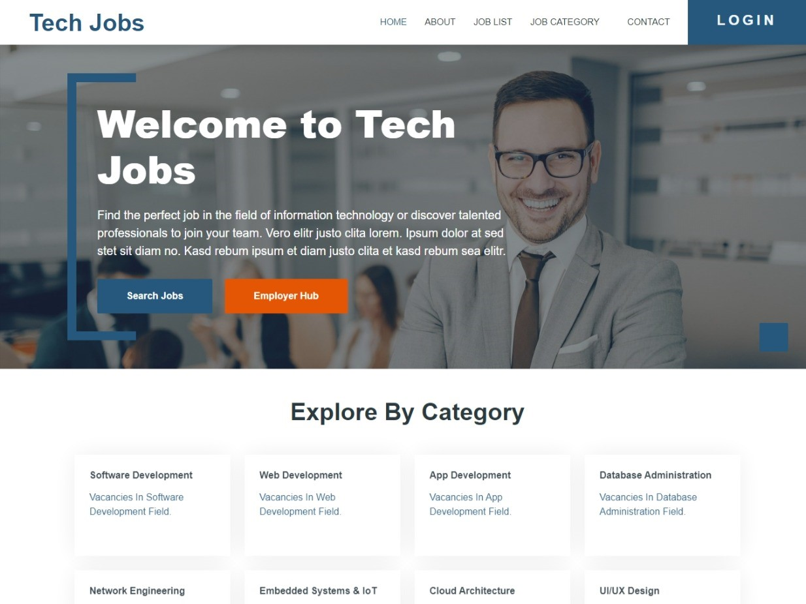

# Tech Jobs Website

Welcome to **Tech Jobs Website**, a comprehensive job portal designed specifically for technology-related positions. This platform allows job seekers in various tech fields such as development, UI/UX design, app development, web development, database administration, network engineering, embedded systems, and IoT to find job opportunities. Employers can also use the platform to find top tech talent for their teams.



---

## Table of Contents

1. [Project Overview](#project-overview)
2. [Features](#features)
3. [How to Set Up the Project](#how-to-set-up-the-project)
4. [Code Explanation](#code-explanation)
5. [Files and Directories](#files-and-directories)
6. [Dependencies](#dependencies)
7. [Contributing](#contributing)
8. [License](#license)

---

## Project Overview

**Tech Jobs Website** is built to provide a simple yet powerful platform for tech job seekers and employers. It allows users to search for jobs, apply to relevant positions, and learn more about the companies offering the jobs. The website also features job listings, company profiles, and user management features.

---

## Features

### 1. **Job Search**
   - **Advanced Filters**: Filter job listings based on job title, category, location, and experience.
   - **Job Categories**: Browse through various job categories like Software Development, UI/UX Design, App Development, Network Engineering, and more.

### 2. **User Registration and Login**
   - **Account Creation**: New users can easily create an account to manage their applications and personal details.
   - **Login and Logout**: Existing users can log into their accounts to apply for jobs and update their information.

### 3. **Job Listings**
   - **Detailed Job Descriptions**: Each job listing includes details such as the company name, position, requirements, and a description of the responsibilities.
   - **Company Profiles**: Learn more about the companies offering the jobs, including contact information and other relevant details.

### 4. **Apply for Jobs**
   - **Easy Application Process**: Job seekers can apply for jobs directly through the website by filling out an application form.

### 5. **Responsive Design**
   - **Mobile-Friendly**: The website adapts to various screen sizes, making it easy to use on mobile phones, tablets, and desktops.

---

## How to Set Up the Project

Follow these steps to get started with the **Tech Jobs Website** project:

### 1. Clone or Download the Repository

You can download the project by cloning it from the GitHub repository:

```bash
git clone https://github.com/Ziad-Abaza/project-web.git
```

### 2. Set Up the Database

The project uses MySQL for database management. To set up the database, execute the provided SQL script:

1. Open your MySQL client and create a new database:
   
   ```sql
   CREATE DATABASE job_seekers_db;
   ```

2. Import the database schema from `database/job_seekers_db.sql` to set up the required tables and relationships.

### 3. Configure Your Web Server

Move the project files to the root directory of your web server (e.g., Apache, Nginx).

### 4. Start the Web Server

Ensure your web server is running. You can use Apache or Nginx. Here’s how to start the Apache server:

```bash
sudo service apache2 start
```

### 5. Access the Website

Once your server is running, open your browser and navigate to `http://localhost` to view the website.

---

## Code Explanation

### Traits

#### ValidatorTrait

- This trait provides functions for validating user input and ensuring data integrity.
- Functions include `validateRequestData`, `makeValidator`, and `validateField`.

#### HandleFileTrait

- Handles file uploads and deletions.
- Functions include `uploadFile`, `getFolderByFileType`, and `deleteFile`.

#### CrudOperationsTrait

- This trait provides CRUD operations for interacting with the database.
- Functions include `createRecord`, `getRecord`, `getByCategory`, `updateRecord`, and `deleteRecord`.

### Classes

#### UserLogin and UserRegistration

- These classes manage user authentication, allowing users to log in and register with email/password. They also manage user permissions and access control.

---

## Files and Directories

Here’s a breakdown of the key files and directories in the project:

- **index.php**: The homepage of the website, which includes job listings and company profiles.
- **job-detail.php**: Displays detailed information about each job.
- **company-detail.php**: Displays information about each company offering jobs.
- **login.php**: Handles user login functionality.
- **register.php**: Allows new users to register for an account.
- **profile.php**: Allows users to view and update their profile information.

### Directory Structure:

```
/project-web
    ├── /assets
    │   └── screenshot.png
    ├── /database
    │   └── job_seekers_db.sql
    ├── /includes
    │   └── header.php
    │   └── footer.php
    ├── index.php
    ├── login.php
    ├── register.php
    └── company-detail.php
```

---

## Dependencies

- **PHP**: The backend of the website is powered by PHP, a widely-used server-side scripting language.
- **MySQL**: The website uses MySQL as the database management system to store job listings, company information, and user data.
- **Bootstrap**: The frontend is styled using the Bootstrap framework for responsive, mobile-first design.
- **Font Awesome**: Used for icons in the user interface.

---

## Contributing

We welcome contributions to improve this project. If you’d like to help, please follow these steps:

1. Fork the repository.
2. Create a new branch for your feature or bug fix.
3. Commit your changes and push them to your fork.
4. Submit a pull request to the main repository.

---

## License

This project is open-source and available under the MIT License. See the [LICENSE](LICENSE) file for more details.

---

### Final Thoughts

The **Tech Jobs Website** is an essential tool for tech professionals seeking their next job opportunity, and for employers looking to hire the best talent in the industry. With a clean interface and user-friendly features, this project provides a robust solution for connecting tech professionals with exciting career opportunities.

